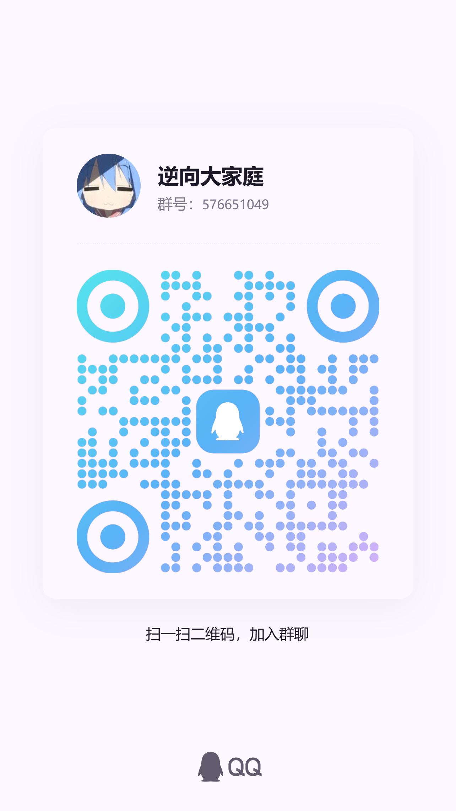

<div align="center">
  
  <br>
  <b>逆向大家庭</b>
  <br><br>
  <b>QQ</b>：3986612313
  <br>
  <b>TG</b>：<a href="https://t.me/abcdefgjha">@abcdefgjha</a>
</div>

# Shell-VM

Shell-VM 是一个将 Shell 脚本编译为字节码并由 C++ 虚拟机执行的项目，当前支持将解释器与脚本一并打包为 Android 单文件可执行程序，最终产物名默认与输入脚本文件名一致。

## 功能概览

- Shell 脚本编译为 VM 字节码
- C++ 运行时加载并执行内嵌字节码
- 支持 Android NDK 交叉编译
- 支持把解释器和脚本打包成单文件可执行程序
- 默认生成面向交付的静默运行器，仅输出目标脚本自身内容

## 目录结构

```text
shell-vm/
├── include/               # 头文件
├── src/                   # VM、编译器、运行时实现
├── tools/                 # 宿主端工具，如 embed_bytecode
├── examples/              # 示例代码
├── build_android.py       # Android 打包脚本
├── embedded_runner.cpp    # 内嵌字节码运行器入口
└── test.sh                # 当前默认打包脚本
```

## 本地构建

先生成宿主端工具：

```bash
cmake -S . -B build
cmake --build build --target embed_bytecode
```

## Android 打包

默认脚本已切换为 `test.sh`，默认打包架构为 `arm64-v8a`，可直接执行：

```bash
python build_android.py --clang
```

如果需要指定其他脚本：

```bash
python build_android.py --clang --script .\your_script.sh
```

生成后的可执行文件位于：

```text
build_android/libs/arm64-v8a/<输入脚本文件名>
```

## 设备运行

```bash
adb push "build_android/libs/arm64-v8a/your_script.sh" /data/local/tmp/your_script.sh
adb shell "chmod +x /data/local/tmp/your_script.sh && /data/local/tmp/your_script.sh"
```

## 开发说明

- `build_android.py` 负责宿主工具构建、字节码嵌入和 Android 交叉编译
- `embedded_runner.cpp` 为最终单文件程序入口
- `tools/embed_bytecode.cpp` 用于把脚本字节码导出为 C++ 数组
- `src/compiler.cpp`、`src/runtime.cpp`、`src/vm_core.cpp` 分别负责编译、运行时和虚拟机核心逻辑

## 作者与联系

- 作者：`abcdefgjh`
- QQ：`3986612313`
- TG：[@abcdefgjha](https://t.me/abcdefgjha)

## 开源协议

本项目采用 GPL v3 或更高版本协议发布，详见 [LICENSE](LICENSE)。
